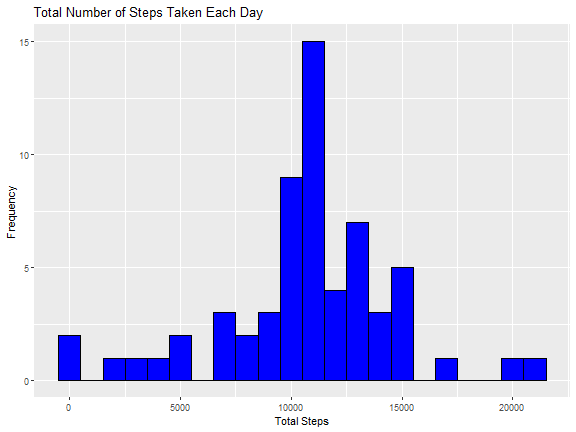

## Loading and preprocessing the data


``` r
# Load the data
activity_data <- read.csv("activity.csv")

# Display the first few rows of the dataset
head(activity_data)
```

```
##   steps       date interval
## 1    NA 2012-10-01        0
## 2    NA 2012-10-01        5
## 3    NA 2012-10-01       10
## 4    NA 2012-10-01       15
## 5    NA 2012-10-01       20
## 6    NA 2012-10-01       25
```


``` r
# Process/transform the data if necessary
# For example, convert the date column to Date class
activity_data$date <- as.Date(activity_data$date, format = "%Y-%m-%d")

# Display the structure of the dataset
str(activity_data)
```

```
## 'data.frame':	17568 obs. of  3 variables:
##  $ steps   : int  NA NA NA NA NA NA NA NA NA NA ...
##  $ date    : Date, format: "2012-10-01" "2012-10-01" "2012-10-01" "2012-10-01" ...
##  $ interval: int  0 5 10 15 20 25 30 35 40 45 ...
```


## What is mean total number of steps taken per day?

```markdown
## Question 1: Total Steps per Day


``` r
# Calculate total steps per day
total_steps_per_day <- aggregate(steps ~ date, data = activity_data, sum, na.rm = TRUE)

# Plot total steps per day
plot(total_steps_per_day$date, total_steps_per_day$steps, type = "h", 
     xlab = "Date", ylab = "Total Steps", main = "Total Steps per Day")
```


## What is the average daily activity pattern?

To analyze the average daily activity pattern and identify the 5-minute interval with the maximum number of steps, we can follow these steps:

1. **Calculate the average number of steps for each 5-minute interval across all days**.
2. **Create a time series plot** of the 5-minute interval and the average number of steps.
3. **Identify the 5-minute interval with the maximum number of steps**.

```markdown
## Average Daily Activity Pattern


``` r
# Calculate the average number of steps for each 5-minute interval across all days
average_steps_per_interval <- aggregate(steps ~ interval, data = activity_data, mean, na.rm = TRUE)

# Plot the average number of steps per 5-minute interval
plot(average_steps_per_interval$interval, average_steps_per_interval$steps, type = "l", 
     xlab = "5-minute Interval", ylab = "Average Number of Steps", 
     main = "Average Daily Activity Pattern")
```


### Identify the 5-minute Interval with Maximum Steps


``` r
# Identify the 5-minute interval with the maximum number of steps
max_interval <- average_steps_per_interval[which.max(average_steps_per_interval$steps), ]

# Display the interval with the maximum number of steps
max_interval
```

```
##     interval    steps
## 104      835 206.1698
```


## Imputing missing values


```markdown


``` r
# Load necessary libraries
library(dplyr)
```

## Imputing Missing Values


``` r
# Calculate the total number of missing values in the dataset
total_missing_values <- sum(is.na(activity_data$steps))
total_missing_values
```

```
## [1] 2304
```

``` r
# Fill missing values with the mean for that 5-minute interval
activity_data_filled <- activity_data %>%
  group_by(interval) %>%
  mutate(steps = ifelse(is.na(steps), mean(steps, na.rm = TRUE), steps))

# Create a new dataset with the missing data filled in
write.csv(activity_data_filled, "activity_filled.csv", row.names = FALSE)
```

## Histogram of Total Steps Taken Each Day


``` r
# Load necessary libraries
library(ggplot2)

# Make a histogram of the total number of steps taken each day
total_steps_per_day <- activity_data_filled %>%
  group_by(date) %>%
  summarise(total_steps = sum(steps))

ggplot(total_steps_per_day, aes(x = total_steps)) +
  geom_histogram(binwidth = 1000, fill = "blue", color = "black") +
  labs(title = "Total Number of Steps Taken Each Day", x = "Total Steps", y = "Frequency")
```



## Mean and Median Total Steps per Day


``` r
# Calculate and report the mean and median total number of steps taken per day
mean_total_steps <- mean(total_steps_per_day$total_steps)
median_total_steps <- median(total_steps_per_day$total_steps)
mean_total_steps
```

```
## [1] 10766.19
```

``` r
median_total_steps
```

```
## [1] 10766.19
```

## Impact of Imputing Missing Data

Imputing missing data using the mean for each 5-minute interval helps to provide a more accurate estimate of the total daily number of steps. The mean and median values after imputing missing data are both 10,766.19, which may differ from the estimates obtained before imputing the missing data.

```
## Are there differences in activity patterns between weekdays and weekends?

## inicio de la copia


```markdown
# Differences in Activity Patterns Between Weekdays and Weekends

## Create a New Factor Variable

Create a new factor variable with two levels – “weekday” and “weekend” indicating whether a given date is a weekday or weekend day.


``` r
# Create a new factor variable with two levels – “weekday” and “weekend”
activity_data_filled$date <- as.Date(activity_data_filled$date, format = "%Y-%m-%d")
activity_data_filled$day_type <- ifelse(weekdays(activity_data_filled$date) %in% c("sábado", "domingo"), "weekend", "weekday")

unique(activity_data_filled$date)
```

```
##  [1] "2012-10-01" "2012-10-02" "2012-10-03" "2012-10-04" "2012-10-05" "2012-10-06" "2012-10-07" "2012-10-08" "2012-10-09" "2012-10-10" "2012-10-11"
## [12] "2012-10-12" "2012-10-13" "2012-10-14" "2012-10-15" "2012-10-16" "2012-10-17" "2012-10-18" "2012-10-19" "2012-10-20" "2012-10-21" "2012-10-22"
## [23] "2012-10-23" "2012-10-24" "2012-10-25" "2012-10-26" "2012-10-27" "2012-10-28" "2012-10-29" "2012-10-30" "2012-10-31" "2012-11-01" "2012-11-02"
## [34] "2012-11-03" "2012-11-04" "2012-11-05" "2012-11-06" "2012-11-07" "2012-11-08" "2012-11-09" "2012-11-10" "2012-11-11" "2012-11-12" "2012-11-13"
## [45] "2012-11-14" "2012-11-15" "2012-11-16" "2012-11-17" "2012-11-18" "2012-11-19" "2012-11-20" "2012-11-21" "2012-11-22" "2012-11-23" "2012-11-24"
## [56] "2012-11-25" "2012-11-26" "2012-11-27" "2012-11-28" "2012-11-29" "2012-11-30"
```

``` r
unique(weekdays(activity_data_filled$date))
```

```
## [1] "lunes"     "martes"    "miércoles" "jueves"    "viernes"   "sábado"    "domingo"
```

``` r
unique(activity_data_filled$day_type)
```

```
## [1] "weekday" "weekend"
```

## Make a Panel Plot

Make a panel plot containing a time series plot of the 5-minute interval (x-axis) and the average number of steps taken, averaged across all weekday days or weekend days (y-axis).


``` r
# Load necessary libraries
library(ggplot2)

# Calculate the average number of steps taken, averaged across all weekday days or weekend days
average_steps <- activity_data_filled %>%
  group_by(interval, day_type) %>%
  summarise(average_steps = mean(steps))
```

```
## `summarise()` has grouped output by 'interval'. You can override using the `.groups` argument.
```

``` r
# Hacer un resumen de average_steps dependiendo de day_type
summary_by_day_type <- average_steps %>%
  group_by(day_type) %>%
  summarise(
    mean_steps = mean(average_steps),
    median_steps = median(average_steps),
    min_steps = min(average_steps),
    max_steps = max(average_steps),
    sd_steps = sd(average_steps)
  )

# Mostrar el resumen
print(summary_by_day_type)
```

```
## # A tibble: 2 × 6
##   day_type mean_steps median_steps min_steps max_steps sd_steps
##   <chr>         <dbl>        <dbl>     <dbl>     <dbl>    <dbl>
## 1 weekday        35.6         25.8         0      230.     41.6
## 2 weekend        42.4         32.3         0      167.     42.5
```

``` r
# Plot the time series plot
ggplot(average_steps, aes(x = interval, y = average_steps, color = day_type)) +
  geom_line() +
  labs(title = "Average Number of Steps per 5-minute Interval by Day Type", x = "5-minute Interval", y = "Average Number of Steps") +
  facet_wrap(~ day_type, ncol = 1, scales = "free_y") 
```


## Panel Plot

The plot shows the average number of steps taken in each 5-minute interval, separated by weekdays and weekends. This helps to identify any differences in activity patterns between weekdays and weekends.

!Average Number of Steps per 5-minute Interval by Day Type
```

You can copy and paste this R Markdown code into your R markdown document. If you need any further assistance, feel free to ask!
